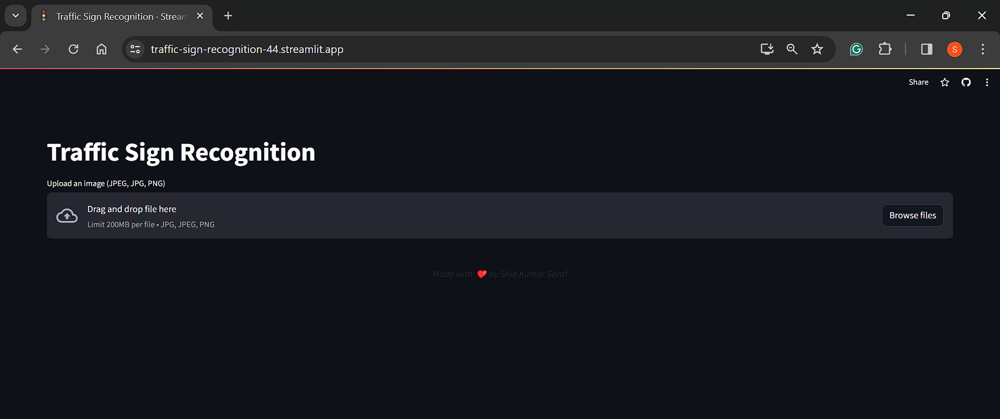
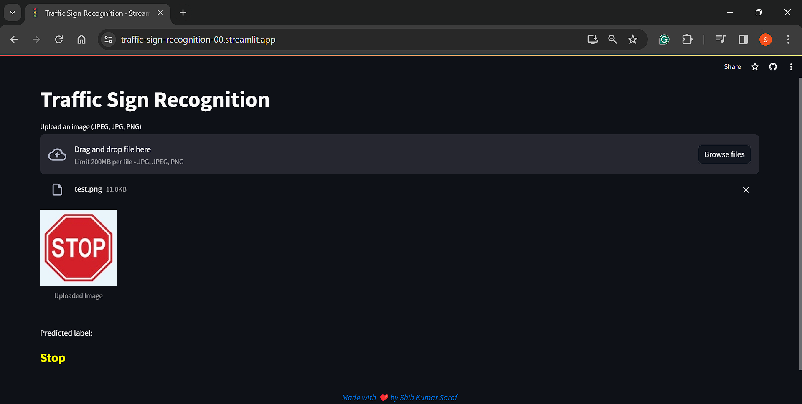

# Traffic Sign Recognition
## Overview
This project aims to build a **Traffic Sign Recognition** system using deep learning techniques. The system's primary objective is to accurately classify different types of traffic signs, contributing to automated sign detection and interpretation on roads.
## Features
- **Classification**: The system can classify various categories of traffic signs, including speed limits, regulatory signs, and warning signs.
- **CNN Architecture**: Utilizes a Convolutional Neural Network (CNN) architecture for efficient feature extraction and classification of traffic sign images.
- **High Accuracy**: Achieves a **Test Accuracy** of **98%**, ensuring reliable and accurate recognition of traffic signs.

## Project Architecture
The project architecture consists of several key components:

1. **Data Preparation**:
   - Collection and annotation of a dataset containing images of different traffic signs.
   - Preprocessing techniques such as resizing, normalization, and augmentation are applied to enhance the dataset's quality and diversity.

2. **Model Development**:
   - Designing a CNN model using the Keras framework, comprising convolutional layers, max-pooling layers, batch normalization, dropout, and dense layers.
   - Training the model to classify traffic sign images into distinct categories.

3. **Training**:
   - Splitting the dataset into training and validation sets.
   - Training the model on the training set using optimization techniques and data augmentation to improve performance and generalization.

4. **Evaluation**:
   - Evaluating the trained model on a separate test set to assess its accuracy and effectiveness.
   - Computing evaluation metrics such as accuracy, precision, recall, and F1-score to quantify the model's performance.

5. **Model Deployment**:
   - Saving the trained model for deployment in real-world applications.
   - Integrating the model into systems for real-time traffic sign recognition tasks in using streamlit wep app.


## Web App <a name="web-app-screenshots"></a>
<table align="center">
  <tr>
    <td></td>
  </tr>
    <tr>
    <td></td>
  </tr>
</table>


## Getting Started<a name="getting-started"></a>

Before you can run the this app, ensure that you have the necessary prerequisites installed on your machine.

### Prerequisites<a name="prerequisites"></a>

Make sure you have the following installed:

- [Python 3.x](https://www.python.org/downloads/): The programming language used to run the app.


### Installation<a name="installation"></a>

Follow these steps to set up the this app on your local machine: 

1. **Clone the Repository:**

   Open your terminal and run the following commands:

   ```bash
   git clone https://github.com/shib1111111/Traffic-Sign-Recognition.git
   cd Traffic-Sign-Recognition

   ```
2. **Install Dependencies:**

Run the following command to install the required dependencies:

```bash
pip install -r requirements.txt
  ```

## Usage<a name="usage"></a>
To run the this app, execute the following command in your terminal:
```bash
streamlit run app.py  
```
Visit the provided local URL (usually http://localhost:8501) in your web browser to access the app. <br>

or directly go to deployed server url : https://traffic-sign-recognition-00.streamlit.app/

## Contributing<a name="contributing"></a>

We welcome contributions to enhance this. Feel free to open issues or submit pull requests.

## License<a name="license"></a>

This project is licensed under the [MIT License](LICENSE).

Thank you for using this! Feel free to reach out with any questions or feedback.

<em style="color: #ff66b2; font-weight: bold;">✨ --- Designed & made with Love by Shib Kumar Saraf ✨</em>
